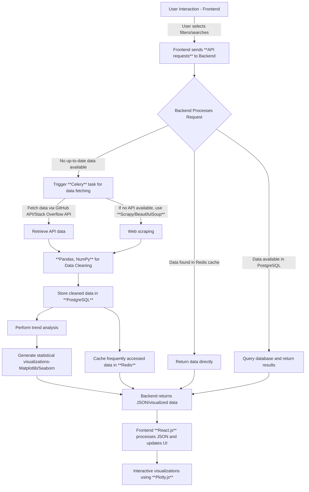

# 1. Introduction

  In the era of information explosion, the technology and software development landscape is evolving at an extraordinary pace. New framework, libraries, technologies, and open-source projects emerge almost every day, some of these drive continuous waves of technological progress, while a rare few introduce transformative breakthroughs that redefine entire fields. But in this overwhelming flood of information, how can individuals proactively discover and identify key trends and seize new opportunities?

  Despite the power of search engines like Google and Bing, and the recommendation algorithms of platforms like TikTok and YouTube, the information we receive remains secondhand, passive, fragmented, and scattered across multiple sources, making it difficult to track and manage. This often traps us in an information cocoon and confines our vision to a narrow range of topics instead of a global perspective, preventing us from exploring new horizons and discovering new possibilities.

  While open-source communities like GitHub bring us closer to cutting-edge technology, their complex search syntax and relatively high entry barriers make them not friendly and less accessible to beginners and non-technical users. Many individuals lack an effective way to proactively discover valuable projects or find content that aligns with their interests. Therefore, we hope to lower the barriers for ordinary people to obtain information and learn about technology, and build a tech-focused information aggregation website,  which reflects some hotspots and trends in the field of technology through data analysis and visualization, and present them in a dashboard-style interface for a comprehensive overview. Furthermore, this website will be highly customizable, allowing users to set their preferences and filters to find out the items and news that meet their needs, and collect and manage them. In the future, if our ability allows, we plan to make it into a browser start page, plug-in, VSCode extension, or desktop component for PC and mobile devices.

# 2. Features

- **Cross-platform Data Integration**. The website consolidates data from multiple popular and professional within the industry, including *GitHub, Stack Overflow, Reddit, Hacker News*. This provides users with a unified, one-stop solution for information retrieval across various sources.

- **Dynamic Updates**. The website can continuously gather, consolidate, filter, and display the newest technical projects, articles, and news, ensuring that users are always up-to-date with the latest trends and developments.

- **Interactive Visualization**. The website utilizes dynamic visual tools like interactive bar charts, pie charts, line graphs, word clouds, and ladder charts to display the popularity, growth, distribution, and trends of different projects and topics. The charts also support zooming in and out, as well as capturing sections, and allows users to download them as PNG files.

- **Customizable Experience**. The website offers a set of predefined filter criteria that address common user needs. Also, users can customize their own filters based on their preferences, such as programming languages, project types, and time ranges.

- **Personalized Favorites**. Users can save their favorite projects, articles, and news to their personal collection. Each item can be tagged with labels, notes, and colors, and organized into folders, addressing the problem of scatted resources and making it easier to manage important content.

- **Multi-device Synchronization**. The website supports account registration and login, allowing users to synchronize their settings, favorites, and collections across multiple devices, ensuring a seamless experience regardless of the device they are using.

# 3. Detailed Design

Our website primarily focuses on filtering **GitHub projects**, using this as a core functionality. In this report, we'll use this as an example to illustrate our design.  
In the future, we plan to expand to other platforms and enhance or modify features.    
The website consists of the following four main modules:

## Part 1: (Homepage) One-stop, Multi-dimensional GitHub Project Filtering and Visualization

We have provided the following filtering criteria for users, which reflect the fundamental attributes and impact of a project. These criteria are also critical metrics in our project evaluation and algorithm design:
| Keywords | Description|
| :----: | :---: |
| `language` | Filtered by the primary `programming language` used in the project, such as *Python, JavaScript, Java, C++*, |
| `topic` | Filtered by hotspot `topic`, such as *web development*, *machine learning*, *blockchain*, *AI*.|
| `stars count` | The number of `stars` reflects the popularity of a project, indicating how many people find it useful and are willing to follow it. This can be filtered by categories such as "more than 10,000 stars" or "between 5,000 and 10,000 stars"|
| `forks count` | The number of `forks` indicates how many people have copied the project to their own repositories and made modifications.|
| `contributors count` | The number of `contributors` reflects how many people have taken part in the project's development, indicating the size and activity of the project's community.|
| `organization` | Filtered by the `organization` that published the project, such as Google, Facebook, Microsoft|
| `issues count` | The number of `issues` reflects how many problems, bugs, or feature requests have been reported by users, indicating the project's maintenance status and user feedback.|
| `pull requests count` | The number of `pull requests` reflects how many external contributions have been made to the project, indicating the project's openness and community engagement.|
| `when was created` | The `creation date` indicates when the repository was first published, allowing users to filter repo based on their age.| 
| `when was last updated` | The `last update date` indicates when the repository was last modified, allowing users to filter repo based on their activity level.|

## Part 2: Dashboard
This section of the website aims to provide a comprehensive and intuitive overview of trending technologies and popular projects through a variety of interactive visual charts. With real-time updates, users can gain a better understanding of industry trends and current hot topics, helping them stay informed about the latest developments in the tech world. The dashboard could includes the following components:

- **Bar Chart** showing the repositories with the most `stars` created in the past week.
- **Bar Chart** displaying the repositories with the most `forks` created in the past month.
- **Line Chart** illustrating the trend in `programming language` popularity over time.
- **Bar Chart** presenting the most popular projects for each `programming language`.
- **Word Cloud** highlighting the current `trending topics`.
- **Line Chart** tracking the fastest-growing `followers` for contributors and organizations over the past week.
- **Pie Chart** representing the distribution of projects across different `programming languages`.
- **Ladder Chart** displaying the `hot topics` and popular `questions` from Stack Overflow, Reddit, and Hacker News.
- **Global Open-source Map** showing the number, quality, and activity level of open-source projects across different `countries`.

## Part 3: Personalized Customization

We’ve taken into account the different intended user base and their specific needs, creating more precise filtering options and control interfaces based on vertical fields segmentation. Users can also personalize their search page by adjusting, adding, or removing filters and controls as needed. 
The following are some examples of user segments and Corresponding search scenarios predefined for them:

- **Programming Beginners/Entry-level Learners**: Interested in tutorials for learning new technologies or concepts, and exploring the official documentation and examples of programming languages, frameworks, or third-party libraries:
  - Repositories with detailed `README.md` files, could contain a significant number of `pdf`, `image`, `video`, or website URLs.
  - Repositories with `tutorial` or `guide` tags.
  - Repositories containing `Jupyter Notebook` or `Colab` interactive code files.
  - Repositories with a `wiki` section.
  - List links to `official documentation` repositories for popular languages such as *Java*, *Python*, frameworks like *React*, *Django*, *FastAPI*, and libraries like *TensorFlow*, *PyTorch*, *Scikit-Learn*.
- **Intermediate-level Students**: Looking for some suitable projects to practice, participate in open source projects to gain experience, prepare for job hunting, or further study in a certain field.  
  - Repositories with `good first issue` or `help wanted` tags.
  - Repositories with a `CONTRIBUTING.md` file.
  - Repositories with numerous `issues` and `pull requests`.
  - Repositories related to popular tech stacks like *React*, *Vue*, *Node.js*, *Django*, *Spring Boot*.
  - Repositories containing keywords like `interview`, `LeetCode`, `algorithm`.
- **Investors and Product Managers**: Looking for high-potential projects and teams to invest in:
  - Repositories with sponsor, funding, invest tags, indicating the project is seeking commercialization or sponsorship.
  - Repositories with rapid growth in `stars`, `forks`, and `contributors`
  - Repositories with `roadmap`, `milestone`, `plan` keywords, helipng to assess long-term value.
  - Repositories with open-source licenses like `MIT`, `Apache`, `GPL`, suitable for commercial applications.
- **Software and Gaming Enthusiasts**: Interested in finding fun, useful software, games, plugins, and mods:
  - Repositories containing `download`, `installation guide`, `deploy`, `setup` keywords.
  - Repositories with `mod`, `game`, `plugin`, `extension` tags.
  - Repositories containing files with extensions like `.exe`, `.apk`, `.dmg`, `.dll`, `.env`, `.yaml`, `.jpg`, `.mp4` ,`.obj`, indicating that the repository includes complete configurations, resource files, and automation scripts that needed for an application.
- **Advanced Developers and Tech Enthusiasts**: Want to keep up with the latest technologies and track trending projects:
  - Repositories covering cutting-edge topics like *LLM*, *AI*, *Web3*, *blockchain*, *NFT*, *DeFi*, *Metaverse*.
  - Repositories containing `research papers`, `arXiv`, `conference` papers.
  - Repositories published by major companies like *Google*, *Facebook*, *Microsoft*, *Amazon*.
  - Repositories updated frequently with multiple version numbers, `experimental`, or `beta` tags.

## Part 4: Personal Favorites
This is a section dedicated to each user personally, allowing users to paste the url of items, videos, articles, websites they are interested in here, and the back-end programme will automatically identify the basic content of the link, and automatically generate a corresponding module containing the website icon and title.  
This page provides a GUI interface, you can create your own folders, attach colour labels, notes; support priority management, such as a limited number of top, according to the number of times the user often clicks on the collection of time sorting; also support for export and import functions.
   
# 4. Ethical Analysis / Impact Analysis

>**Q1**: Since the platform aggregates GitHub data and features, it may divert traffic from GitHub, Hacker News, and similar sites.
- **Mitigation**: 
  - All interactive elements will include direct links to the corresponding pages, ensuring that users will visit source pages for detailed project information. 
  - The platform will not host any content, only providing a summary and visualization of the data.
>**Q2**: Frequent API call requests and data capture may cause some pressure on these website server. 
  - **Mitigation**: 
    - The website will strictly adhere to API rate limits and implement caching and request delay mechanisms to reduce redundant queries.
    - User request limitations will be introduced, such as enforced cooldown intervals between requests, to prevent excessive traffic.
>**Q3**: The process of calling the GitHub API to get project information may involve users' personal information, and data capture may violate the GitHub usage policy; if you store data about personal contact information, social accounts, etc. on GitHub, it may involve privacy issues.    
  - **Mitigation**: 
    - The website will comply with GitHub's API usage policy, ensuring that data is used for non-commercial, educational, and research purposes only.
    - Do not display or store any private information such as personal contact information, and only display the name, description and evaluation parameters of a project. 
>**Q4**: Flawed screening logic and algorithms may cause short-term hotspots to be over-amplified, exacerbate technology bubbles and the herd effect, and lead to users lacking judgement to blindly learn technologies that may be rapidly phased out or have limited application.
  - **Mitigation**:    
    - Get some media and professionals' evaluation and comment for a project, so as to increase users' understanding of the project and reduce the number of blind followers.    
    - Set the labels of 'emerging technology' and 'mature technology' to distinguish between short-term hotspots that appear out of nowhere and long-term stable and ecologically mature technologies.  

# 5. Technical Architecture

## Data Fetching
To ensure efficient and reliable data retrieval, we prioritize using official APIs whenever possible:

- Utilize `requests`, `httpx` to fetch up-to-date public data from GitHub, Stack Overflow, Reddit, and Hacker News via their respective **APIs**.
- For platforms that do not provide APIs, leverage **Python web scraping** such as `BeautifulSoup` and `Scrapy` to extract relevant content.
- Implement `Celery` for asynchronous task scheduling and background processing, ensuring that data is updated at regular intervals (e.g., every hour or daily) without affecting real-time user interactions.

## Data Processing 
Once the raw data is collected, it undergoes thorough processing to ensure consistency and usability:

- Use Python's built-in `json` module and `BeautifulSoup` to parse API responses and extract relevant data from `HTML tags` when necessary.
- Employ `Pandas` and `NumPy` for data cleaning, transformation, and aggregation, preparing the dataset for analysis and visualization.

## Data Storage
A well-structured storage system ensures fast data retrieval and efficient management of user preferences and historical trends:

- `MySQL` / `PostgreSQL` as the primary relational database for storing user favorites, filtering conditions, and historical data trends.
- `Redis` for caching frequently accessed data, significantly improving response times for popular queries.

## Web Frontend
- Languages: **HTML**, **CSS**, **JavaScript**.
- Framework: 
  - **React.js** for creating dynamic and interactive UI components.
  - **Bootstrap** for styling design and layout.
  - **Plotly.js** for generating interactive visualizations like line charts, pie charts, and word clouds.
  
## Web Backend
- Languages: **Python**.
- Frameworks:
  - **Django** for user authentication, session management, and seamless frontend-backend communication.
  - **FastAPI** for high-performance data queries and recommendation algorithms, ensuring fast response times for complex filtering operations.

## Architecture Diagram

